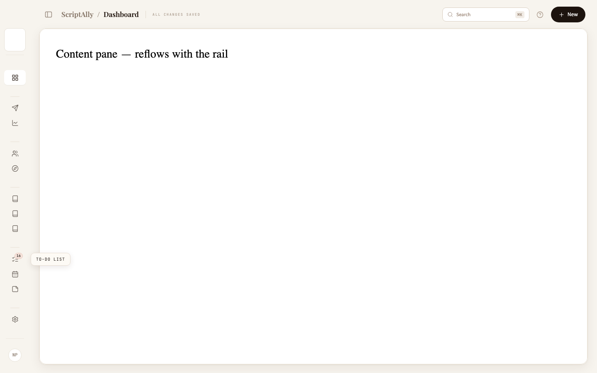
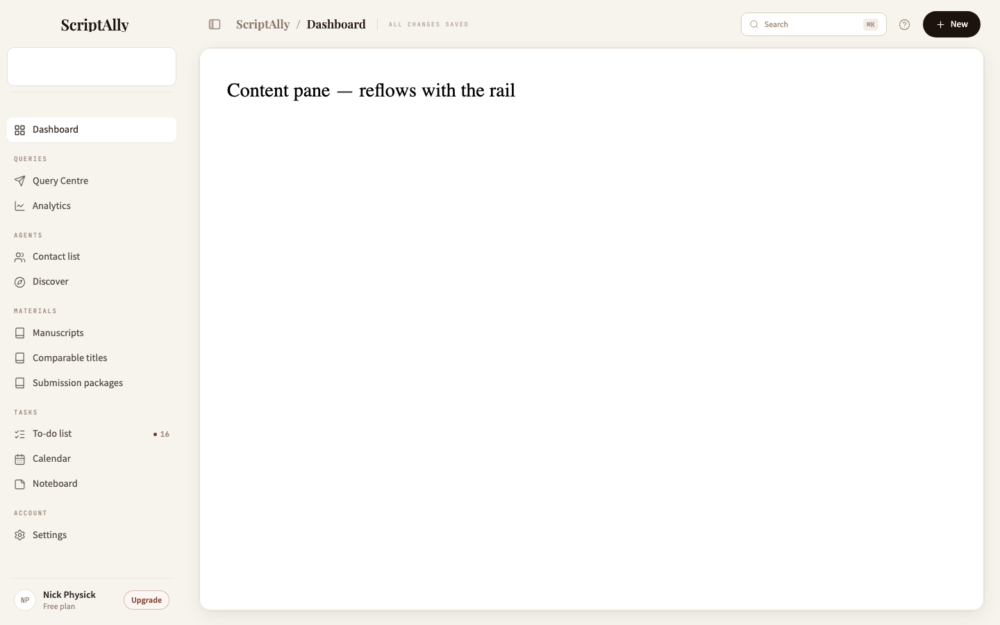
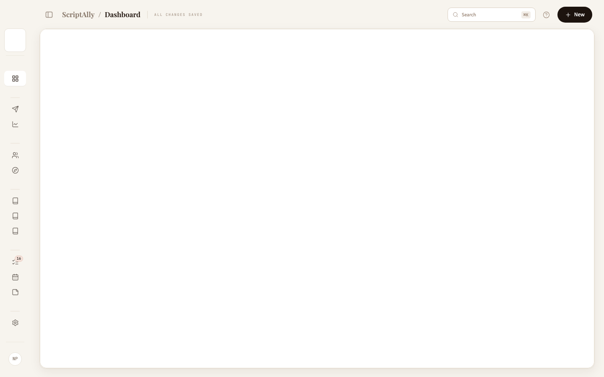

# Sidebar collapse to icon rail

**Pack:** sidebar-collapse (Step 0 + 4 phases) · **Ref:** `design-refs/sidebar-collapse-v1.html`
**Stream:** this file is this stream's only report. Shared checkout with other live sessions throughout; every commit `--only`-staged by explicit path.

---

## Step 0 — recon, and what it changed

**Baseline** (before any edit): tsc exit 0 · build exit 0 · vitest **3,930 passed / 2 skipped, 243 files**. Close: **3,949 passed / 3 skipped, 244 files** (+1 skipped-unless-asked harness) — no worse; +19 net from this pack's tests and the lib extension, with other streams landing throughout.

The pack's recon questions, answered against this codebase:

- **Where the width lives:** one token, `--shell-panelw: 264px` (index.css), read by `.ws-panel` and `.ws-pin`. Not a red-gate.
- **`deskTooltip.ts`:** exists (`src/lib/deskTooltip.ts` pure maths + `components/dashboard/DeskTooltip.tsx`), already portals to a fixed layer on `document.body`, anchored by a caller-measured rect — usable from the shell as-is. Not a red-gate.
- **Mobile:** below 768px `.ws-panel` and `.ws-pagebar` are both `display: none`; the mobile bar + bottom tabs own navigation. No drawer owns a collapse concept. Not a red-gate.
- **Keyboard:** `[` bound **nowhere**. `⌘\` bound — **to a ghost** (next section).

**No literal red-gate fired.** One finding changed the plan's shape:

### The ⌘\ "collision" was with a corpse — swept before Phase 1 (`44aaa2a`)

AppShell still carried the sv2-era tuck machinery (27 Jul, flyouts/rail-section packs): `panelCollapsed` persisted under `sa.shellSideTucked`, a window-level `⌘\` binding, Escape-collapse, outside-click browse abandonment, and **collapse-on-every-navigation**. Its only styled surface — `.sv2-collapsed .sv2-side` — targets an element **rendered nowhere**: the app-shell-v2 rebuild deleted the rail and retired the collapse model, and the machinery survived unswept. Measurable ghost behaviour live until the sweep: `⌘\` toggled invisible state, every route change force-wrote `sa.shellSideTucked = "1"`, stray Escapes wrote localStorage.

The pack says *"do not silently rebind an existing shortcut"* — this is the loud version: the binding's feature is demonstrably absent, the sweep is its own documented commit, and the chord the pack wants (the Notion/Linear/Claude convention) is claimed by the same concept's successor. **The old key is abandoned, not migrated** — collapse-on-navigate means it reads "collapsed" for every user regardless of choice; migrating it would start everyone collapsed.

Not swept: `shellV2Nav`'s pure helpers and tests (dead-but-tested lib, the house's tolerated state), and `ShellV2.tsx` (the locked mobile bar still renders it — its tuck button was already inert in effect and is now inert in fact; flagged for a mobile pass).

---

## The phases

| commit | |
|---|---|
| `44aaa2a` | Step 0.5 — the tuck-ghost sweep (−109 lines) |
| `9931fa8` | P1 — state, persistence, seam toggle, brand collapse, design ref |
| `9d3f404` | P2 — rail geometry |
| `620a7ce` | P3 — rail tooltips through the extended deskTooltip |
| (this)   | P4 — a11y, tests, screenshots, report |

**P1.** `useSidebarCollapsed`: synchronous initialiser read (an effect-read renders expanded and snaps shut on every load); `scriptally:sidebar-collapsed` — the pack's verbatim key, diverging from the house `sa.` prefix by instruction, recorded at the definition; `ready` gates every transition and arrives by **double** rAF (one can land inside the hydration frame). Keyboard per pack: chord always, bare `[` only outside editables, `preventDefault` on the chord only. The toggle is first in the pagebar — the seam — 34px, the ref's panel glyph with a burgundy fill-block that fades keyed off `aria-expanded`, so the icon cannot disagree with the state it reports. Brand: gap-0-plus-margin so the mark centres truly at 72px (a flex gap beside a zero-width child holds itself open — 4.5px off-centre otherwise).

**P2.** 72 ↔ 264px, `240ms cubic-bezier(.32,.72,.28,1)`, width and padding only — the gap→margin mechanism applied uniformly (rows, selector, user row) so every former gap collapses with its text. Labels became spans (a text node cannot carry max-width). Counts restyle in place into the corner mini-badge — same CountChip, dot hidden (the pink is the alert at 8.5px), absent count still renders nothing. Section labels go `color: transparent` under a centred 22×1 hairline — exact box preserved, words stay in the a11y tree. Collapsed manuscript tile **expands the sidebar instead of opening the flyout** — the menu is panel-anchored and would render as a 72px sliver (decision recorded at the handler). Upgrade zeroes border *and* padding, or it survives as a stray lozenge.

**P3.** `deskTooltip` extended, not duplicated: `placeTooltipRight` (12px right, centred, **clamps** where the desk placement flips — flipping left would cover the rail it describes), `side`/`variant` props defaulted so the desk's callers are byte-identical, a `dk-tip--rail` skin (parchment, mono 10px uppercase, the pack's shadow, translateX entrance). 120ms on rows, collapsed only; 250ms on the toggle, both states, platform-correct `⌘\`/`Ctrl+\`. Portalled — the panel is `overflow: hidden` and the nav scrolls internally, so a `::after` tooltip dies at the 72px edge exactly as the pack warns. Mousedown hides (a tip never rides a navigation); expanding via `[` while one is open hides it.

**P4.** `aria-label="Main"` on the nav (was absent), constant across states. Reduced motion: the sheet's last-in-file blanket (`transition-duration: .01ms`) covers the width change — instant — while the tooltip, portalled outside `.ws-app`, keeps its fade, which is the pack's split exactly. 16 unit tests: persistence round-trip (+ throwing-storage), the full keyboard grammar, badge-only-with-count, synchronous-read/first-markup-collapsed, double-rAF, no-`display:none`-on-labels, no-transform-in-collapse-transitions, portal-not-::after.

---

## Verification — render and look

| | |
|---|---|
|  |  |

Real `WorkspaceShell` markup against the **built** stylesheet (the house harness rule), headless Chrome at 1440×900:

- **Expanded — untouched.** Inline `· 16` count, labels, sections, Upgrade, all as before this pack.
- **Collapsed — the spec.** 72px; icons centred; **16** in the pink corner badge on To-do only; hairlines where the section labels were, same rhythm; the 40px tile alone; the avatar alone; the toggle's fill-block faded.
- **Tooltip** (top image): parchment mono fly-out 12px right of the To-do row, vertically centred, rendered **outside** the panel's clip.
- **Mobile 375×812:** no rail, no toggle (both display:none'd by existing rules — the toggle rides the pagebar's own hiding). The mobile bar is AppShell-mounted and out of this harness by construction; nothing in this pack touches below-768 rendering.
- **Viewport-lock probe:** with the rail collapsed, the designated scroll zone still scrolls — set `scrollTop = 400` on the scroller, read back `400` (not a clipping false-positive; the harness carries 1600px of content). ⚠️ **The pack names `.ws-cscroll`; that class is stale** — the scroller moved to `.ws-wbody` (it carries `#app-stage-scroll`), per the comment trail in AppShell/WorkspaceShell. The probe targets the real one.

Charts recon (pack asked): `OneScreenChart` redraws from a **ResizeObserver** — no one-shot width reads found anywhere in the reflow path. Nothing to patch, nothing to flag.

---

## Decisions and findings the pack should know about

1. **The tuck-ghost sweep** — above. The estate (⌘\) passed to this feature; the stored key did not.
2. **Hover-nudge archaeology.** The polish pass's `span:not(.ws-ic)` nudge *described* the label but only ever *matched* the count chip (the label was a text node), and its `.sp-count` twin matched nothing (CountChip renders `sp-ct`). Wrapping the label would have handed it the nudge as a silent behaviour change — the selector now names `.sp-ct`: **today-exact, kept over two-week-old unrendered intent**, per the LOCKED rule. The two dead `.sp-count` rules went with it.
3. **Motion lock extended by signature.** `motionPolish.test` allows exactly two named layout transitions; this pack mandates width/padding/max-width motion (transform would stack-context the panel and isolate blended marks). Its transitions are allowed **by their curve** — `240ms cubic-bezier(.32,.72,.28,1)` is the exception's name — so a layout transition *without* the curve still fails, and the door stays as narrow as it was.
4. **Collapsed manuscript click expands** rather than opening a 72px-wide flyout sliver. One extra click, one menu geometry.
5. **Avatar stays 32px** (pack says 36) — the pack's number is its ref's; resizing the avatar is a restyle, which the pack itself forbids. Same reasoning kept row height 36px against the ref's `padding: 10px 0`.
6. **One dead-shell lock retargeted** (`workspaceShell.test`): `collapsed` left its dead-word list — that lock guards the rail-and-panel model, whose four mechanism words still stand.
7. **Tombstone traps, twice, in this pack's own tests** — the ghost-key guard caught the hook's history comment; the CSS section anchor was itself a comment. Both now assert against stripped code / rule anchors, per the house rule they re-proved.

## Not done / follow-ups

- The mobile bar's inert tuck button (pre-existing; LOCKED surface) — a mobile pass should remove it.
- `shellV2Nav`'s dead-but-tested helpers — sweepable whenever the mobile bar stops importing ShellV2.
- Dev deploy: not run (the pack ends at commits; say the word).
