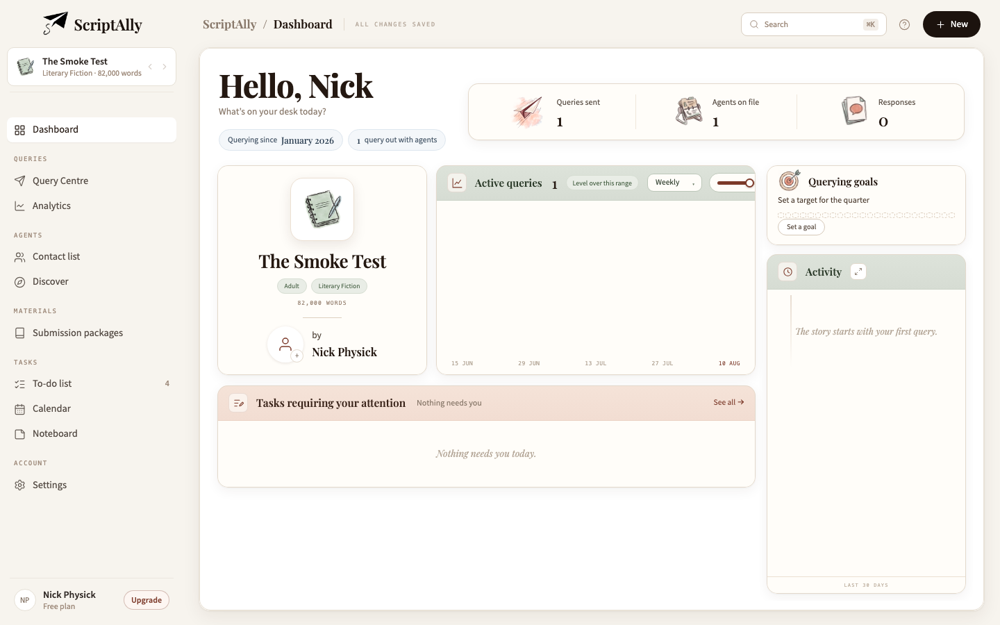
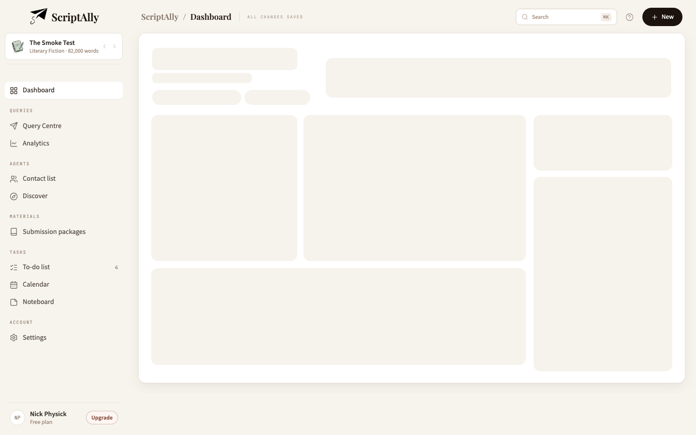
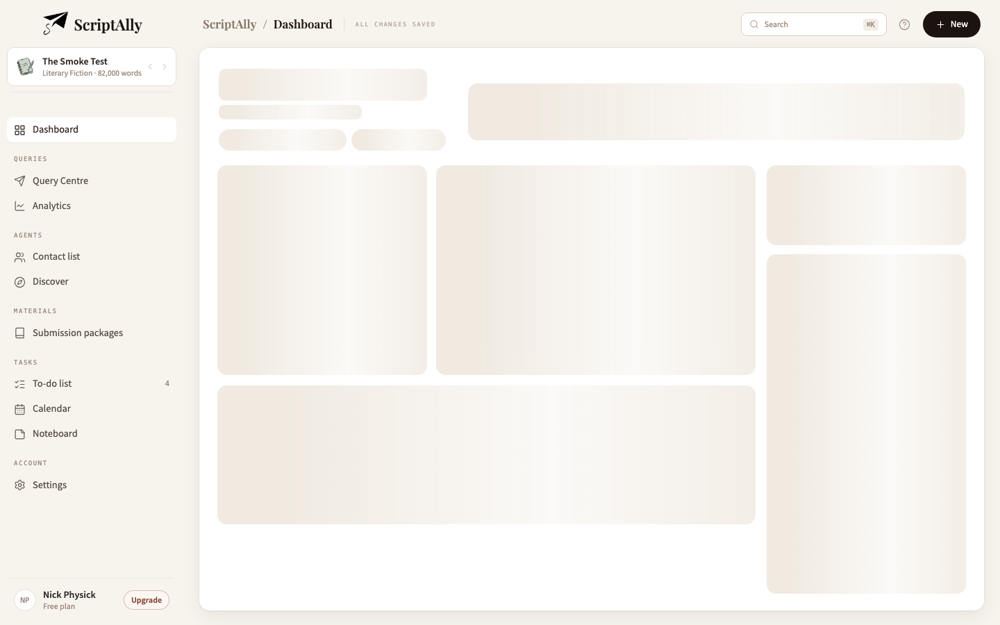

# Loading skeleton, header, brand and sidebar

**Pack:** skeleton-header-sidebar (7 phases) · **Ref:** `design-refs/dashboard-audit.html`
**Branch:** `main`, direct, in the dedicated worktree `/Users/nickphysick/ScriptAlly-skel`
**Suite at close:** 3,923 passing · 3 skipped · 244 files. tsc + production build + full Vitest green before every commit.
**Deployed:** no. Hosting-only when it goes; nothing here touches rules, functions or data.

---

## Commits

| | |
|---|---|
| `294e2e4` | the audit ref, and the watercolour plane it asks for |
| `19c76eb` | P1 — the loading skeleton, and the two thresholds under it |
| `0fcef79` | P2 — the date line goes, a question takes its place |
| `b3236fc` | P3 — Queries sent takes the painted plane |
| `a5f26db` | P4 — the plane-and-S leads the sidebar, and the crumb finds its root |
| `bdf0d83` | P5 — the nav runs in the work's order, and Settings comes up out of the foot |
| `3a76add` | P6 — one ground with nothing drawn on it, and a sidebar that gives |

(`501fc88`, the band-tier header, is another stream's and landed mid-run — see *The base moved under me*.)

---

## The assets

**Only one was new.** `Scriptally_Logo_new.png`, extracted from the ref, is **byte-identical** to
`public/scriptally-logo-new.png` — already in the repo since 8 Jul, same sha256, same 500×500. It was
not committed a second time: one image under two paths is two things that can drift.

Both assets arrived embedded in the ref as base64 rather than as loose files, and were extracted from it.

**⚠️ `active-query-image.png` is 743KB.** That is 35× the ~20KB of every other counter mark — 800×800
for a 54px render. It is committed **as supplied**: it is Nick's artwork and the ref is drawn with these
exact bytes, so resampling it silently was not mine to do. But it is worth naming, in a pack whose first
phase is about load performance: **a resample to ~320px would be visually identical at every rendered
size and would return roughly 90% of those bytes.** Say the word and it is a one-line follow-up.

It also took the directory's kebab-case convention (`active-query-image.png`) so it reads as a sibling of
the five marks already in `src/assets/shell/`, rather than as a stray.

---

## P1 · The loading skeleton

**The geometry is the page's own, reused.** `OneScreenSkeleton` renders `.os-content` / `.os-greet` /
`.os-gl` / `.os-colM` / `.os-midrow` / `.os-colR` verbatim — so every column width, gap and padding is
declared once, up the sheet, where the real cards read it. A second copy of the grid would agree on the
day it was written and drift the first time a column moved, **silently**, because nothing renders both at
once to compare.

That paid off inside this same run: **P6 changed the sidebar from 214px to 264px, moving the whole content
column 50px, and the skeleton followed with no edit.** Re-measured after: every block still lands on the
loaded page at 0.0px.

| block | ghost − loaded |
|---|---|
| author tile | t 0.0 · l 0.0 · w 0.0 · h 0.0 |
| chart | t 0.0 · l 0.0 · w 0.0 · h 0.0 |
| tasks | t 0.0 · l 0.0 · w 0.0 |
| goal | t 0.0 · l 0.0 · w 0.0 · h 0.0 |
| activity | t 0.0 · l 0.0 · w 0.0 |
| counters | t 0.0 · **l −0.3** · w +0.3 · h 0.0 |

Only **three** ghosts need a number at all, because only three are content-driven — and content is the one
thing a skeleton by definition lacks:

- **counters 82px.** ⚠️ **Not the pack's 79** — that is the ref's card, with different padding. This app
  renders 82 and did before this pack. Copying the ref's number would have produced a ghost that matched
  the mockup and jumped in the app.
- **goal 115px**, its first-run height. ⚠️ Also not the ref's 89. A goal that has been *set* renders a
  different body and no number is right for both while we are still waiting to learn which — it does not
  matter, because `.os-sk-actv` beneath it is `flex: 1 1 auto` and absorbs the difference *inside* the rail.
- **tasks 200px**, likewise approximate (the real card floats between 118 and 318). It is the last block in
  its column with slack beneath it, so its error moves nothing.

The **pill widths** turned out to matter more than they look: `.os-gl` is `flex: 0 0 auto`, so the greeting
column is exactly as wide as its pills row and the counters card starts after it. Ghost pills 20px narrow
put the whole counters card 20px out. Measured against the real pair: 184 + 7 + 136 = 327.

### Timing — the three paths, driven

Two thresholds, not one: **nothing below ~200ms**, and **~400ms minimum once shown**. A skeleton shown for
90ms says nothing and costs a flash, and a flash reads as a fault rather than as a wait. Past the minimum
it leaves at once — a 1–2s hold was rejected in the pack as measurably slower for nothing anyone wants.

The pack asked for the three paths tested with a stubbed delay. This repo's vitest is `node` with no jsdom
and no testing-library, so a hook cannot be rendered here — which would have left the driver covered only
by "it mentions the right constants". So the decision is pulled out into `skeletonStep`, and the test runs a
real timeline through it against a stubbed clock:

| path | events | frames observed |
|---|---|---|
| fast resolve | loading 0 → false @150 | **none** — never raised |
| early resolve | loading 0 → false @230 | shown @200, hidden @600 (**400ms exactly**) |
| long wait | loading 0 → false @5000 | shown @200, hidden @5000 (**no residual hold**) |
| boundary | loading 0 → false @201 | shown @200, hidden @600 — the 1ms flash the hold exists for |
| already loaded | loading false @0 | **none** — nothing ever armed |

**⚠️ A vestigial version of this was already in `Dashboard.tsx` and is deleted.** `showSkeleton` was set by
a 180ms timer and **read by nothing** — left standing when the early skeleton return was removed. It had no
minimum either, so even wired up it would still have flashed.

### Motion

Shimmer sweeps `translateX(-100%) → 100%`, 1.25s, infinite, **transform only**. Keyframe selectors are
literal percentages — a `var()` in a keyframe *selector* is not resolved, the whole block is dropped, and
the shimmer simply never runs with no error and no red build.

**⚠️ Reduced motion kills the animation NAME, not its duration.** This sheet's blanket rule forces
`animation-duration: .01ms !important` on everything inside `.os-root`; on an *infinite* sweep that is a
strobe, not a stillness. Verified visually under `--force-prefers-reduced-motion`:

Normal motion, for comparison: 

---

## P2 · Header

Date line **deleted** — rule and element both, locked, so the tombstone cannot be quietly reinhabited.
`What's on your desk today?` sits under the name at 13.5px `#8a7a6c`, 6px below the h1.

It is a **constant**, deliberately: every other line in this header is derived, and this is the only piece of
address on the page. A computed subtitle would be a fourth readout competing with the pills beneath it.

Third occupant of that slot — kicker → date line → nothing. Re-measuring here also closed P1's last gap:
`.os-sub2`'s line box is **20.3px**, not the 19 the ghost had been given, and that one rounded number had put
every card below it 1.3px low.

---

## P3 · Queries sent takes the plane

54px against its siblings' 44px, with the negative margin growing in step (−12 against −8), so the artwork
still cannot set the row height. **Counters card measured 82px before and 82px after**; each counter row is
50px, driven by its label and figure. Size and margin are asserted *together*, because setting one without
the other is the exact shape of the trap that file already guards.

**⚠️ It is the one mark exempt from `mix-blend-mode: multiply`, and the exemption is narrow by construction.**
Multiply exists because the other marks are drawn on an opaque white field and render as white squares on
parchment without it. This artwork is genuinely transparent — 3% white in the corners — so multiply has no
field to remove and darkens the wash instead. `.os-mark-il img` still carries multiply, so a fourth
line-drawn mark inherits it and still fails loudly without it. Both halves are locked.

Verified in the browser: plane 54×54, blend `normal`, loaded, **no white square**; both siblings 44×44,
blend `multiply`.

---

## P4 · The brand

Mark bare on the ground at **38px** — no plate, no border, no fill (locked; a plate is exactly what a later
pass adds to "tidy" a floating logo). Mark **beside** the wordmark, pair **centred**: measured, pair centre
107.0 against the sidebar's 107.0 — **0.0px**, against the 3px the pack allows.

**⚠️ The wordmark is TYPE again — the third swing of that pendulum**, so the reasoning is recorded rather
than left for a fourth. "The asset is the mark, type is a lookalike" is a fair argument and it lost to a
plainer one: `/scriptally-title-v2.png` is only ~51.7% ink, so its element height was never its cap height
(33px bought a ~17px cap) and every future size change had to carry that compensation. Playfair at 22px is
22px. The ink-ratio trap still holds wherever that PNG is still used — it no longer applies here.

**⚠️ The 3px vertical compensation left with it.** The brand row's top padding was 19px against the pagebar's
16px purely to lift the asset's box. With type it returns to 16px and the alignment falls out: 16 + half the
38px mark = **35.0**, against the crumb's **35.1**. The number that must stay level is the *mark's* centre,
not the row box's — the row is 16/14 asymmetric and its box centre is 34, which nobody sees.

**The crumb's root is back, as words.** No image rides the pagebar (asserted), but removing the *root* along
with the logotype had left the bar opening on a bare `/ Dashboard` — a separator with nothing to its left.
It reads `ScriptAlly / Dashboard` again and navigates home, because every other segment there does. The
one-brand rule is about the **mark**, which still appears exactly once.

---

## P5 · Sidebar structure

Dashboard alone, then **Queries · Agents · Materials · Tasks · Account**.

Tasks no longer leads. The 6 Aug decision — Tasks is a *section*, not a page under Querying — is untouched
and still locked; only its position moved. The three above it are the querying work itself, in the order it
happens; Tasks is what falls out of that work.

**Settings came up out of the foot** into a new Account section. As a lone row below the divider it was a
destination living in the furniture — the one page you could not find by reading down the nav. The foot is
now the user row and nothing else, which is what makes the divider mean something: above it, places to go;
below it, who you are. `.ws-setrow` is **deleted**, not orphaned.

**⚠️ The rows were not hand-written.** The order lives in `workspaceNav`; the rows come from `TODO_ROUTES`
(three pages since Today was retired on 9 Aug). Typing them out to reorder the section would have re-forked
the sidebar from the router and the palette. **Both icon keys were added** — `WORKSPACE_ICONS` is a parallel
surface, not type-linked, so a section added without its glyph renders an empty cell rather than failing.

Two notes on the locks found there: `workspaceNav.test.ts` carries the **same copy-pasted body across four
tests whose names describe four different things** — a pre-existing artefact of an earlier bulk retarget,
updated in place and left no wider than it was. And the new order assertion compares the **rendered headings
against the model's sections** rather than both against a hand-typed list, which two literals cannot do: they
agree happily the day someone changes both in the same wrong direction.

---

## P6 · Sidebar sizing

**The hairline is deleted, not softened.** "One ground" has been the rule since app-shell-v2 — sidebar and
page share `--ws-ground`, the sidebar paints nothing — and `.ws-panel::after` was the last thing still
claiming otherwise. The lock is *finished* rather than relaxed: same token, paints nothing, **nothing divides
them**. ⚠️ `position: relative` stays on the panel regardless: the manuscript flyout anchors to it, and that
failure would be silent.

Width **214 → 264px**, moved *with* the type scale rather than beside it — the old width's justification was
"the narrowest that still fits the longest label", answered against a 13.5px row.

| element | to | measured |
|---|---|---|
| Nav items | 14.5px | ✓ |
| Section labels | 9px | ✓ |
| Manuscript title | 14px | ✓ (does not truncate: scrollWidth 146 = clientWidth 146) |
| Manuscript sub-line | 11.5px | ✓ |
| User name | 14px | ✓ |
| Plan line | 12px | ✓ |
| Upgrade pill | 12px | ✓ |
| To-do badge | 11px | ✓ |
| Wordmark | 22px | ✓ |
| Nav icons | 17px | ✓ |

All ten are locked in **one** test: stepping one without the others is the mistake worth catching.

(The pack calls this 246 → 264. **246 is the ref's own starting width and was never this app's** — live was
214px.)

### The one scrolling region

| viewport height | panel overflows | nav scrolls | foot inside viewport |
|---|---|---|---|
| 950 | no | no (fits) | yes (940) |
| 900 | no | no (fits) | yes (890) |
| 800 | no | no (fits) | yes (790) |
| 720 | no | **yes** (578 > 505) | yes (710) |
| 640 | no | **yes** (578 > 425) | yes (630) |

Scrolling starts between 800 and 720 — the pack's "~740px" exactly. Three things make it work, all locked:
`min-height: 0` (a flex item's default `auto` refuses to shrink below its content, so without it the *list*
pushes the foot off instead of scrolling); `overscroll-behavior: contain` (or the scroll chains out and the
sidebar quietly drives the content window); and brand/selector/foot pinned `flex: none` (or at a short
viewport they compress instead, making the sidebar subtly wrong everywhere rather than obviously wrong in one
place). The hidden scrollbar is set in both idioms, since neither covers every browser alone.

---

## Verification method

**⚠️ The harness loads `dist/assets/index-*.css` and renders the REAL component tree** — `WorkspaceShell`
wrapping `OneScreenDashboard` through the repo's own `renderPageSeeded` — per the CLAUDE.md rule. Inlining a
hand-picked list of sources omits Tailwind's preflight, which has shipped a wrong, measured, locked fix here
before. The generator is local-only (`SA_HARNESS=1`, skipped in the normal suite) and is **not committed**.

Screenshots are real 1440×900 captures via headless Chrome, which also supplied
`--force-prefers-reduced-motion` — the browser pane cannot emulate that media query.

---

## The base moved under me — worth knowing

**Every worktree in this repo shares the `main` ref.** Mid-run, another session committed `501fc88` and my
worktree's HEAD jumped to it while my files stayed behind, so `git status` suddenly showed 17 files I had
never touched as *staged*. Nothing was lost: their 17 paths and my 3 were disjoint (checked before acting),
and the worktree was resynced with `git checkout HEAD -- <their explicit paths>`, leaving my uncommitted work
untouched. Every commit here used `git commit --only -- <explicit paths>`, which is what makes that safe.

Two consequences worth flagging:

1. **A stale worktree silently invalidates a gate.** Between the jump and the resync, any suite I had run was
   against a tree that was part-mine, part-old-`main`. I re-ran all three gates after resyncing.
2. If several sessions are going to run concurrently on `main`, checking `git rev-parse main` against `HEAD`
   before each commit is cheap insurance. I did it at every commit here.

---

## Open / not done

- **The 743KB plane** — committed as supplied; resample is a one-line follow-up (see *The assets*).
- **`CLAUDE.md` not updated** — the pack does not ask for it, and I did not want to write into a file another
  session may be holding. Three notes there now read differently and are yours to fold in when convenient:
  the sidebar's type scale and width, the wordmark's return to type in `WorkspaceShell`, and the crumb root.
  Nothing in CLAUDE.md is *contradicted* — the notes on the 68.4%-ink title asset and "the brand appears
  exactly once" both describe the capsule shell and both still hold.
- **Not deployed.** Eyeball on dev before prod: the sidebar at 264px against real manuscript titles, the
  plane's wash on the counters card at your own screen's colour, and the skeleton on a genuinely slow load.
